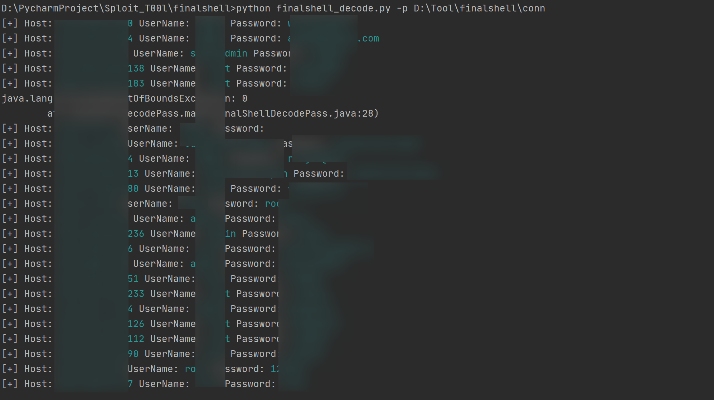

依赖于https://github.com/jas502n/FinalShellDecodePass ，支持批量获取FinalShell密码

使用格式：

```
usage: finalshell_decode.py [-h] [-p PATH]

optional arguments:
  -h, --help            show this help message and exit
  -p PATH, --path PATH  the finalshell configuration's root path, example: E:\finalshell\conn
```

-p 传入本地Finalshell配置文件夹即`conn`文件夹的绝对路径，也可dump远程主机配置到本地执行。 示例：

示例：

		